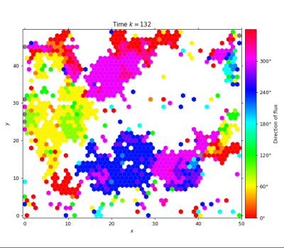
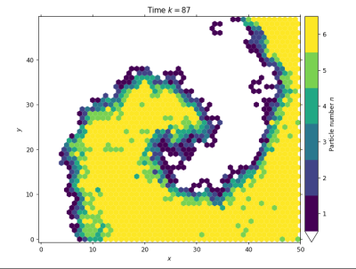
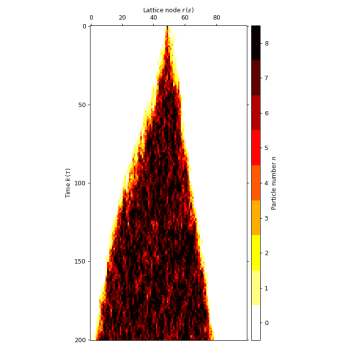
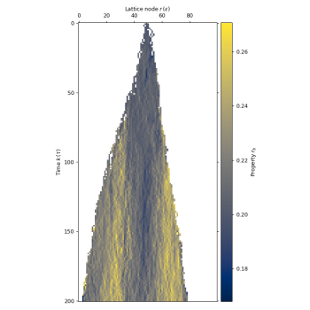

# Welcome to biolgca!
`biolgca` is a Python package for simulating different types of **lattice-gas 
cellular automata (LGCA)** in the biological context.

#### LGCA
LGCA are a subclass of cellular 
automata with an extended state space that allows each particle/cell to have a direction. 
For a more detailed 
introduction see the [Wikipedia article](https://en.wikipedia.org/wiki/BIO-LGCA). 
They present a 
mesoscopic modelling framework to analyse collective phenomena, e.g. cell migration. 
Use cases are demonstrated in this 
[paper](https://journals.plos.org/ploscompbiol/article?id=10.1371/journal.pcbi.1009066).

#### Content 
The package is intended for use in ongoing research as well as to exemplify the unique 
advantages of the framework. It is under active development. The types of LGCA 
currently supported are:
- classical LGCA (volume exclusion, all particles/cells have the same properties)
- identity-based LGCA (volume exclusion, particles/cells can have individual properties)
- LGCA without volume exclusion (all particles/cells have the same properties)

These can be simulated in a 1D, 2D square or 2D hexagonal lattice. A [library of 
interaction rules](link to interaction docs) is already implemented. Adding a custom 
interaction rule or customising other parts of the simulation (e.g. the interaction 
radius) is easy.

Current analysis possibilities include plots of:
- density (+ animation)
- flux (+ animation)
- flow (+ animation)
- full state space (+ animation)
- scalar field
- vector field

The internal state of the LGCA is always accessible for computational analysis.

# Example usage
#### Timestepping and flux plot
```python
from lgca import get_lgca
# specify the alignment interaction
# LGCA geometry: hexagonal lattice, no resting channels and reflecting boundary conditions
# nodes will be initialised randomly
lgca = get_lgca(geometry='hex', interaction='alignment', bc='refl')
# simulate for 132 timesteps without viewing the result
# record the full channel configuration of the lattice at all timesteps
lgca.timeevo(timesteps=132, record=True)
# plot the flux to see clusters of aligned particles moving in the same direction
lgca.plot_flux()
```

#### Live simulation and density profile

```python
from lgca import get_lgca

# specify the excitable medium interaction with interaction parameter N=20
# LGCA geometry: 20 resting channels and reflecting boundary conditions
lgca = get_lgca(interaction='excitable_medium', restchannels=20, N=20, bc='refl')
# initialise a custom lattice configuration
lgca.nodes[...] = 0
lgca.nodes[:lgca.lx // 2, :, :lgca.velocitychannels] = 1  # 6 moving particles per node in the left half of the lattice
lgca.nodes[:, :lgca.ly // 2,
lgca.velocitychannels:] = 1  # 6 resting particles per node in the lower half of the lattice
# view a live simulation: density profile of the velocity channels only
lgca.live_animate_density(channels=slice(0, lgca.velocitychannels), vmax=lgca.velocitychannels)
# the following image results from stopping the simulation after k=87 timesteps
```

#### Identity-based LGCA and 1D plots

```python
from lgca import get_lgca

# identity-based LGCA: each cell can have own properties
# specify the "Go and grow" interaction: cancer cells proliferate and migrate,
# where the birth rate mutates
# LGCA geometry: 1D lattice, 6 resting channels
lgca = get_lgca(interaction='go_and_grow', ib=True, geometry='lin', restchannels=6)
# initialise a custom lattice configuration
lgca.nodes[...] = 0
lgca.update_dynamic_fields()
lgca.nodes[lgca.dims[0] // 2, :] = 1  # 1 fully filled node at the center
# simulate for 200 timesteps and record the full lattice configuration
lgca.timeevo(timesteps=200, record=True)
# plot cell density to see the tumour growth over time
lgca.plot_density(colorbarwidth=0.2)  # plot on the left
# plot the birth rate to inspect its increase
lgca.plot_prop_spatial(propname='r_b')  # plot on the right
```
 

# Getting started
#### Dependencies
`biolgca` heavily depends on `numpy` and `matplotlib`. To install all dependencies 
for using the package, run this from a command line:
```python
pip install matplotlib==3.3.2 numpy pytest scipy sympy
```
(On Windows, a terminal that understands `pip` out of the box can be opened in Anaconda in the 
"Environments" tab, clicking on the triangle next to the environment's name.)

If you want to add code to the package you should also install `pytest` and `sphinx`.

#### Installation
`biolgca` does not have a package distribution yet. To use it, clone (or unzip the download of) 
the master branch of the repository into a folder of your choice.

If your scripts are not going to be in the `biolgca` folder, add the following to
the beginning of the Python files:
```python
import sys
sys.path.insert(1, "/absolute/path/to/folder/biolgca")
```

#### Use
To use the package, simply import the `get_lgca` function:
```python
from lgca import get_lgca
```
It will return an instance of the correct class of LGCA according to the passed 
arguments, e.g. a 1D identity-based LGCA (`IBLGCA_1D`), already initialised with 
the specified initial conditions. This can be used to simulate 
the automaton with the specified interaction and inspect the results.
```python
# request the LGCA
lgca = get_lgca(ib=True, geometry='1d', interaction='random_walk')
# simulate for 50 timesteps
lgca.timeevo(timesteps=50)
# plot the development of the particle/cell density over time
lgca.plot_density()
```
The [Tutorial]() guides you through the argument options.

# Questions/Contribute
The structure of the package and its functionalities are detailed in the 
[documentation](). There you also find [coding examples]().

Issues are tracked on the [GitHub page](https://github.com/sisyga/biolgca/issues).
We collect both bugs and feature ideas there.

For guidelines how to add code to and maintain the repo visit the [Wiki](https://github.com/sisyga/biolgca/wiki).

For remaining questions you can contact us via E-mail.<br>
Simon Syga: `simon.syga@tu-dresden.de`<br>
Bianca Güttner: `bianca.guettner@tu-dresden.de`

# License
GPL-3.0-only: GNU General Public License version >=3

Copyright (C) 2018-2022 Technische Universität Dresden, contact: simon.syga@tu-dresden.de.