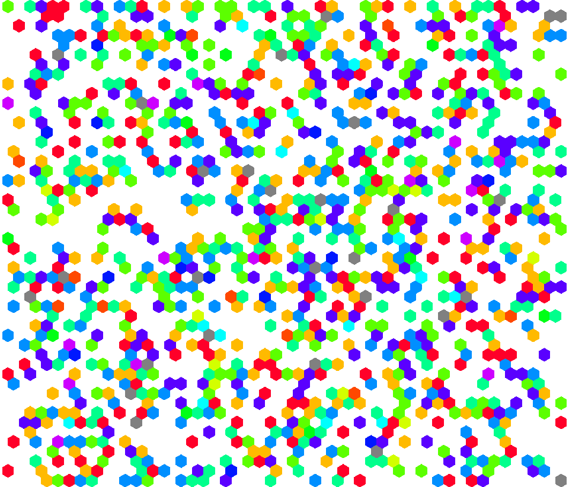
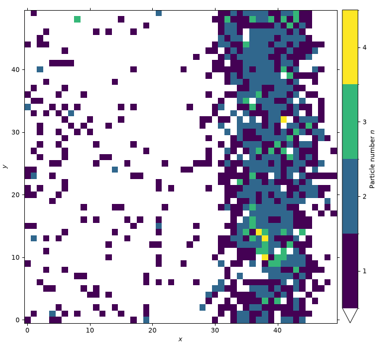
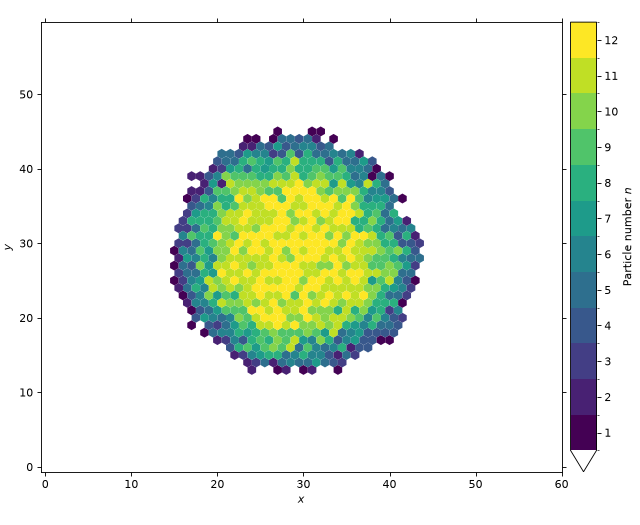

# BioLGCA

[](https://github.com/sisyga/biolgca/actions/workflows/ci.yml)

[](LICENSE.txt)

**Simulate how cells move, align, grow and evolve, in a few lines of Python.**

<p align="center">
  
</p>

BioLGCA implements biological lattice-gas cellular automata (BIO-LGCA). Each
lattice site has one channel per direction of movement and optional rest
channels, so the model tracks how many cells are at each site and where they
are heading. The rules are local and stochastic, which makes simulations fast
and the models accessible to mathematical analysis
([Deutsch et al. 2021](https://doi.org/10.1371/journal.pcbi.1009066)).

With BioLGCA you can:

- combine built-in mechanisms: random walk, alignment, chemotaxis, contact
  guidance, aggregation, birth and death, go-or-grow and phenotype switching;
- write a new interaction as a small Python class and use it like a built-in;
- track individual cells with heritable traits to study evolution;
- run on 1D, square, hexagonal and 3D lattices; and
- save every model as a JSON file that reruns exactly from its seed.

## Quick start

1. [Install uv](https://docs.astral.sh/uv/getting-started/installation/), which
   manages Python and all dependencies for you:

   ```bash
   # macOS and Linux
   curl -LsSf https://astral.sh/uv/install.sh | sh
   # Windows (PowerShell)
   powershell -ExecutionPolicy ByPass -c "irm https://astral.sh/uv/install.ps1 | iex"
   ```

2. Get BioLGCA and open JupyterLab:

   ```bash
   git clone https://github.com/sisyga/biolgca.git
   cd biolgca
   uv sync
   uv run jupyter lab
   ```

   If uv reports that it cannot find Python (some Linux distribution packages
   do not download it automatically), run `uv python install` first.

3. Paste this into a notebook cell to produce the flocks shown above:

   ```python
   from lgca import get_lgca

   lgca = get_lgca(geometry="hex", dims=(50, 50), interaction="alignment",
                   beta=3, density=0.5, seed=2)
   lgca.timeevo(timesteps=100, record=True)
   lgca.plot_flux()  # colour shows the direction of motion
   ```

   `beta` sets how strongly cells align with their neighbours. Try `beta=0`
   (no alignment) or `density=0.2` (sparser cells) and run again.

## Build a model from mechanisms

For a study you will want every assumption written down. A `ModelSpec`
describes the lattice, initial state, time and seed, and the list of
interactions. Here cells align with their neighbours and follow an attractant
gradient; both cues enter one stochastic decision per site:



```python
import numpy as np
from lgca.model import AnalysisSpec, ModelSpec, SpaceSpec, StateSpec, TimeSpec, run_model
from lgca.pipeline import (InteractionPipelineSpec, ReorientationSpec,
                           ReorientationTermSpec)
from lgca.simulation import DensityRecorder

x = np.arange(50)[:, None] * np.ones((50, 50))
signal = np.exp(-((x - 40) / 15) ** 2)  # attractant peaks at x = 40

spec = ModelSpec(
    space=SpaceSpec(geometry="square", dims=(50, 50), boundary="reflecting"),
    state=StateSpec(density=0.5, fields={"signal": signal}),
    time=TimeSpec(steps=100, seed=1),
    dynamics=InteractionPipelineSpec(operators=[
        ReorientationSpec(terms=[  # both cues enter one stochastic decision
            ReorientationTermSpec(name="polar_alignment", beta=1.5),
            ReorientationTermSpec(name="chemotaxis", beta=20, parameters={"field": "signal"}),
        ]),
    ]),
    analysis=AnalysisSpec(observers=[DensityRecorder()]),  # what to record
)
result = run_model(spec)
result.lgca.plot_density()
```

Save the model with `save_model_spec(spec, "model.json")` from `lgca.model`.
Anyone can then rerun it from the command line and get identical data:

```bash
uv run biolgca run model.json --output runs/chemotaxis-001
```

The run directory contains the resolved model, the BioLGCA version and the
recorded densities in `measurements.npz`.

## Growth and phenotype switching



Interactions can also create and remove cells. In the go-or-grow model, cells
either migrate or rest and divide, and crowding changes which they do. One
fully occupied node grows into a spheroid:

```python
spec = ModelSpec(
    space=SpaceSpec(geometry="hex", dims=(60, 60)),
    state=StateSpec(
        restchannels=6,  # resting cells sit in rest channels, moving cells in velocity channels
        initializer={"name": "region", "parameters": {"extent": 1, "density": 12}},
    ),
    time=TimeSpec(steps=90, seed=3),
    dynamics=InteractionPipelineSpec(operators=[
        {"name": "go_or_rest", "parameters": {"kappa": -4, "theta": 0.5}},
        {"name": "go_or_grow.growth", "parameters": {"r_b": 0.2, "r_d": 0.01}},
        {"name": "random_walk", "parameters": {"channels": "velocity"}},
    ]),
)
run_model(spec).lgca.plot_density()
```

Each step, cells switch between moving and resting, die, resting cells
divide, and moving cells pick new directions. With `kappa=4`, crowded cells
rest instead, and the same small colony shrinks: growth then needs a minimum
population, an Allee effect that emerges from the switching rule.

<br clear="right">

## Write your own interaction

A new rule is a Python function of the lattice state. The state offers
operations with a fixed meaning per cell, such as "every cell dies with
probability p", which work with and without volume exclusion and for any
number of species. The decorator registers the rule under its name, with its
parameters taken from the signature. This rule kills cells more often on
crowded nodes; the loop compares three death rates:

```python
from lgca import interaction
from lgca.simulation import PopulationRecorder


@interaction(kind="birth_death", families=("classical", "nove"))
def crowding_death(state, r_d=0.1):
    """Each cell dies with probability r_d * (cells on its node) / (node capacity)."""
    state.remove_cells(r_d * state.density / state.capacity)


for r_d in (0.0, 0.2, 0.5):
    spec = ModelSpec(
        space=SpaceSpec(geometry="square", dims=(40, 40)),
        state=StateSpec(density=1, restchannels=2),
        time=TimeSpec(steps=100, seed=1),
        dynamics=InteractionPipelineSpec(operators=[
            {"name": "birth_death", "parameters": {"birth_rate": 0.1}},
            crowding_death(r_d=r_d),
            {"name": "classical.random_walk"},
        ]),
        analysis=AnalysisSpec(observers=[PopulationRecorder()]),
    )
    result = run_model(spec, showprogress=False)
    print(f"r_d = {r_d}: {result.lgca.n_t[-1]} cells after 100 steps")
```

`lgca.testing.check_interaction(crowding_death)` runs a rule on every lattice
and model family it claims to support and reports what goes wrong, from lost
cells to unseeded random numbers. Movement biases are written the same way
with `@reorientation_term`. The
[custom interaction guide](docs/source/how_to/custom_interactions.rst) shows
growth rules, movement biases and a deterministic collision rule, and tutorial
6 how to test a rule and share it together with a model.

## Learn

Six notebooks take you from the first random walk to a reproducible project.
Every model is built in visible cells and the notebooks run in CI, so they
always work with the current code.

| Lesson | You will learn to |
| --- | --- |
| [1. Fundamentals](docs/source/tutorials/01_fundamentals.ipynb) | set up a lattice, run a random walk, compare boundaries and seeds |
| [2. Collective movement](docs/source/tutorials/02_collective_movement.ipynb) | compare alignment mechanisms and measure order |
| [3. Combining cues](docs/source/tutorials/03_combining_interactions.ipynb) | combine alignment, chemotaxis and contact guidance; sweep parameters |
| [4. Population dynamics](docs/source/tutorials/04_population_dynamics.ipynb) | add birth, death and phenotype switching; go-or-grow |
| [5. Evolutionary LGCA](docs/source/tutorials/05_evolutionary_lgca.ipynb) | track heritable traits across stochastic replicates |
| [6. Student project](docs/source/tutorials/06_student_project.ipynb) | write, test and share your own interaction |

The [example gallery](docs/source/example_gallery.rst) collects further
ready-to-run models, one per question.

## Model types

| | Classical | Identity-based (individual cell traits) |
| --- | --- | --- |
| **Volume exclusion** (at most one cell per channel) | ✓, also with several species | ✓ |
| **No volume exclusion** (many cells per channel) | ✓, also with several species | ✓ |

All model types run on 1D, square and hexagonal lattices, and on cubic and 3D
Moore lattices. 3D rendering uses Mayavi, which is optional: install it with
`uv sync --extra plot3d`.

## Other ways to install

Without uv, install BioLGCA into any Python 3.11+ environment:

```bash
python -m pip install -e .            # add ".[yaml]" or ".[plot3d]" for extras
```

This picks the newest compatible versions of the dependencies. `uv sync` instead
installs the exact versions in `uv.lock`, which the test suite runs against.

## Contributing

Bug reports and ideas are welcome on the
[issue tracker](https://github.com/sisyga/biolgca/issues). `uv sync` also
installs the development tools; run the checks from the repository root:

```bash
uv run pytest -q               # test suite
uv run python docs/build.py    # documentation, executes all tutorials
```

User-facing changes are recorded in [CHANGELOG.md](CHANGELOG.md).

## Citing

If you use BioLGCA in published work, please cite:

> Deutsch A, Nava-Sedeño JM, Syga S, Hatzikirou H (2021). BIO-LGCA: A cellular
> automaton modelling class for analysing collective cell migration.
> *PLoS Computational Biology* 17(6): e1009066.
> <https://doi.org/10.1371/journal.pcbi.1009066>

> Syga S, Nava-Sedeño JM, Deutsch A (2026). A novel cellular automaton approach
> for modeling genotypic and phenotypic heterogeneity in cell systems.
> *The European Physical Journal Special Topics*.
> <https://doi.org/10.1140/epjs/s11734-026-02186-1>

## License

BSD 3-clause, see [LICENSE.txt](LICENSE.txt). Copyright (C) 2018–2026
Technische Universität Dresden.
