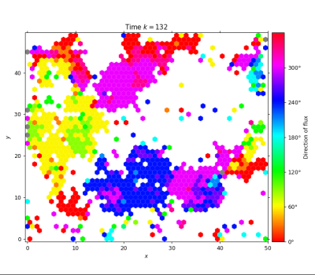

#####################################
Welcome to the biolgca Documentation!
#####################################

`biolgca <https://github.com/sisyga/biolgca>`_ is a Python package for
simulating lattice-gas cellular automata (LGCA) in biological contexts.
Simulations can be built with the traditional :func:`lgca.get_lgca` factory or
with declarative :class:`lgca.model.ModelSpec` objects that separate model
setup, interaction plugins, observer-based logging and plotting.

LGCA
----

LGCA are cellular automata with an extended channel state space. Particles or
cells occupy velocity channels, so the lattice state records both the number of
cells at each node and their movement directions. The package supports
classical, identity-based, volume-exclusion-free and multi-species LGCA models.

For a broader modelling introduction, see the
`BIO-LGCA Wikipedia article <https://en.wikipedia.org/wiki/BIO-LGCA>`_ and the
BIO-LGCA method paper:
`Deutsch et al. 2021 <https://doi.org/10.1371/journal.pcbi.1009066>`_.

Supported models
----------------

The :func:`lgca.get_lgca` factory selects a simulator class from these axes:

- classical LGCA with volume exclusion
- identity-based LGCA with volume exclusion
- classical LGCA without volume exclusion
- identity-based LGCA without volume exclusion
- classical multi-species LGCA with or without volume exclusion

Supported geometries are 1D linear, 2D square, 2D hexagonal, 3D cubic and 3D
Moore lattices. Multi-species identity-based LGCA are not implemented yet.

Current analysis helpers include observer recorders for lattice state, density,
population and identity-based family summaries, plus density, flux, flow,
state-space, scalar-field, vector-field, property and family-population plots.
Plotting features require the optional plotting dependencies.

Quick example
-------------

.. code-block:: python

   from lgca import get_lgca

   lgca = get_lgca(geometry="hex", interaction="alignment", bc="refl", seed=1)
   lgca.timeevo(timesteps=132, record=True)
   lgca.plot_flux()

   Alignment interaction on a hexagonal lattice.

Declarative example
-------------------

.. code-block:: python

   from lgca.model import AnalysisSpec, ModelSpec, SpaceSpec, StateSpec, TimeSpec, run_model
   from lgca.pipeline import InteractionPipelineSpec
   from lgca.simulation import DensityRecorder

   spec = ModelSpec(
       space=SpaceSpec(geometry="hex", dims=(20, 20), boundary="reflecting"),
       state=StateSpec(density=0.2, restchannels=0),
       time=TimeSpec(steps=100, seed=1),
       dynamics=InteractionPipelineSpec(
           operators=[{"name": "classical.alignment", "parameters": {"beta": 2.0}}],
       ),
       analysis=AnalysisSpec(observers=[DensityRecorder()]),
   )

   result = run_model(spec, showprogress=False)
   result.lgca.plot_density()

More examples
-------------

.. list-table::

   * - .. figure:: ../images/excitable_medium_small.png

          Excitable medium

     - .. figure:: ../images/go_and_grow_density_small.png

          Go-or-grow density

     - .. figure:: ../images/go_and_grow_rb_small.png

          Go-or-grow birth rate

Questions and contributions
---------------------------

Issues are tracked on the `GitHub issue tracker <https://github.com/sisyga/biolgca/issues>`_.
For contribution notes, see the repository ``AGENTS.md`` and GitHub wiki.

Contact:

- Simon Syga: simon.syga@tu-dresden.de
- Bianca Güttner: bianca.guettner@nct-dresden.de

License
-------

BSD 3-clause license. See ``LICENSE.txt`` in the repository.

Copyright (C) 2018-2026 Technische Universität Dresden.

.. toctree::
   :maxdepth: 4
   :hidden:

   getting_started
   user_guide
   examples
   example_gallery
   full_api
