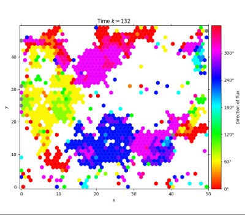
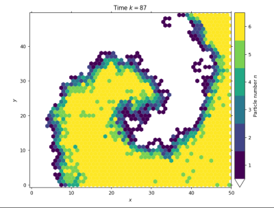

.. biolgca documentation master file, created by
   sphinx-quickstart on Mon Jan 17 11:03:02 2022.
   You can adapt this file completely to your liking, but it should at least
   contain the root `toctree` directive.
   
.. heading convention, suggested by Sphinx:
    # with overline, for parts
    * with overline, for chapters
    = for sections
    - for subsections
    ^ for subsubsections
    " for paragraphs

   
#####################################
Welcome to the biolgca Documentation!
#####################################

`biolgca <https://github.com/sisyga/biolgca>`_ is a Python package for simulating different types of *lattice-gas 
cellular automata (LGCA)* in the biological context.

LGCA
----

LGCA are a subclass of cellular automata with an extended state space that allows 
each particle/cell to have a direction. For a more detailed 
introduction see the `Wikipedia article <https://en.wikipedia.org/wiki/BIO-LGCA>`_. 
They present a mesoscopic modelling framework to analyse collective phenomena, e.g. cell migration. 
Use cases are demonstrated in this 
`paper <https://journals.plos.org/ploscompbiol/article?id=10.1371/journal.pcbi.1009066>`_.

Content
-------

The package is intended for use in ongoing research as well as to exemplify the unique 
advantages of the framework.

.. note::

   This project is under active development and the documentation is under construction.
   
The types of LGCA currently supported are:

- classical LGCA (volume exclusion, all particles/cells have the same properties)
- identity-based LGCA (volume exclusion, particles/cells can have individual properties)
- classical LGCA without volume exclusion (all particles/cells have the same properties)
- identity-based LGCA without volume exclusion (particles/cells can have individual properties)

These can be simulated in a 1D, 2D square or 2D hexagonal lattice. A :ref:`library of interaction rules <interaction_chapter>` is already implemented (documentation under construction). :ref:`Adding a custom interaction rule <adding_own_interactions>` or customising other parts of the simulation (e.g. the interaction radius) is easy.

Current analysis possibilities include plots of:

- density (+ animation)
- flux (+ animation)
- flow (+ animation)
- full state space (+ animation)
- scalar field
- vector field

The internal state of the LGCA is always accessible for computational analysis.

Example usage
-------------

Timestepping and flux plot
^^^^^^^^^^^^^^^^^^^^^^^^^^
.. code-block:: python
    :linenos:

    from lgca import get_lgca
    # specify the alignment interaction
    # LGCA geometry: hexagonal lattice, no resting channels and reflecting boundary conditions
    # nodes will be initialised randomly
    lgca = get_lgca(geometry='hex', interaction='alignment', bc='refl')
    # simulate for 132 timesteps without viewing the result
    # record the full channel configuration of the lattice at all timesteps
    lgca.timeevo(timesteps=132, record=True)
    # plot the flux to see clusters of aligned particles moving in the same direction
    lgca.plot_flux()

    
    Alignment interaction

Live simulation and density profile
^^^^^^^^^^^^^^^^^^^^^^^^^^^^^^^^^^^
.. code-block:: python
    :linenos:

    from lgca import get_lgca

    # specify the excitable medium interaction with interaction parameter N=20
    # LGCA geometry: 20 resting channels and reflecting boundary conditions
    lgca = get_lgca(interaction='excitable_medium', restchannels=20, N=20, bc='refl')
    # initialise a custom lattice configuration
    lgca.nodes[...] = 0
    lgca.nodes[:lgca.lx // 2, :, :lgca.velocitychannels] = 1  # 6 moving particles per node in the left half of the lattice
    lgca.nodes[:, :lgca.ly // 2,
    lgca.velocitychannels:] = 1  # 6 resting particles per node in the lower half of the lattice
    # view a live simulation: density profile of the velocity channels only
    lgca.live_animate_density(channels=slice(0, lgca.velocitychannels), vmax=lgca.velocitychannels)
    # the following image results from stopping the simulation after k=87 timesteps

    
    Excitable media

Identity-based LGCA and 1D plots
^^^^^^^^^^^^^^^^^^^^^^^^^^^^^^^^

.. code-block:: python
    :linenos:
    
    from lgca import get_lgca
    # identity-based LGCA: each cell can have own properties
    # specify the "Go and grow" interaction: cancer cells proliferate and migrate,
    # where the birth rate mutates
    # LGCA geometry: 1D lattice, 6 resting channels
    lgca = get_lgca(interaction='go_and_grow', ib=True, geometry='lin', restchannels=6)
    # initialise a custom lattice configuration
    lgca.nodes[...] = 0
    lgca.update_dynamic_fields()
    lgca.nodes[lgca.dims[0] // 2, :] = 1  # 1 fully filled node at the center
    # simulate for 200 timesteps and record the full lattice configuration
    lgca.timeevo(timesteps=200, record=True)
    # plot cell density to see the tumour growth over time
    lgca.plot_density(colorbarwidth=0.2)  # plot on the left
    # plot the birth rate to inspect its increase
    lgca.plot_prop_spatial(propname='r_b')  # plot on the right

.. list-table::
    
    * - .. figure:: ../images/go_and_grow_density_small.png
    
            Go and grow density
            
      - .. figure:: ../images/go_and_grow_rb_small.png
    
            Go and grow birth rate

Questions/Contribute
--------------------

    The structure of the package and its functionalities are detailed in the other chapters of this documentation. :ref:`Here <examples_chapter>` you can find coding examples (under construction).

    Issues are tracked on the `GitHub page <https://github.com/sisyga/biolgca/issues>`_.
    We collect both bugs and feature ideas there.

    For guidelines how to add code to and maintain the repo visit the `Wiki <https://github.com/sisyga/biolgca/wiki>`_.

    For remaining questions you can contact us via E-mail.
    
    - Simon Syga: simon.syga@tu-dresden.de
    - Bianca Güttner: bianca.guettner@nct-dresden.de

License
-------

BSD 3-clause license (see LICENSE file or `online resource <https://opensource.org/licenses/BSD-3-Clause>`_).

Copyright (C) 2018-2022 Technische Universität Dresden.

.. toctree::
   :maxdepth: 4
   :hidden:

   user_guide
   examples
   full_api

.. To Do: read https://www.sphinx-doc.org/en/master/usage/extensions/autodoc.html?highlight=automodule for structure
               https://numpydoc.readthedocs.io/en/latest/format.html#docstring-standard numpy style docstrings!
			   https://www.python.org/dev/peps/pep-0257/ docstring PEP
   references https://github.com/matplotlib/matplotlib/blob/main/doc/api/cm_api.rst
              https://github.com/matplotlib/matplotlib/blob/main/lib/matplotlib/cm.py
			  https://matplotlib.org/stable/api/cm_api.html
			  https://docutils.sourceforge.io/docs/user/rst/quickref.html reSt cheat sheet
			  
	Synchon:
	Adding to Jörn’s first point: I developed https://gitlab.com/synchon/hawala during my research project and it is 
	one command away from publishing it to PyPI. Maybe that can help you out.
	Adding to Andreas’s last point: https://joss.theoj.org/ is a good way to publish your open-source software. 
	I was involved in one publication here, and I would recommend it.
	I meant the structure that it has like the usage of tools like poetry and tox for linting (via isort), formatting 
	(via black) and testing (via pytest) and so on. I must admit the python packaging space has been a mess for long 
	but it’s getting better. It might be overwhelming at the start. A working example might help you. Let me know if 
	you have some doubts.
	I developed an earlier prototype and reviewed https://joss.theoj.org/papers/10.21105/joss.02342

	need autosummary to generate automodule and autofunction and link them:
	https://stackoverflow.com/questions/2701998/sphinx-autodoc-is-not-automatic-enough/62613202#62613202
	https://github.com/sphinx-doc/sphinx/issues/7912
	https://github.com/JamesALeedham/Sphinx-Autosummary-Recursion main reference from here
	https://alabaster.readthedocs.io/en/latest/customization.html How to customize alabaster
	.function {
    border-bottom: 3px solid #d0d0d0;
    padding-bottom: 10px;
    padding-top: 10px;
	background-color: #e8e8e8;
    }
	.method .field-even {
    padding-top: 0px;
	padding-bottom: 0px;
    }
    .method .field-odd {
        padding-top: 0px;
    	padding-bottom: 0px;
    }
